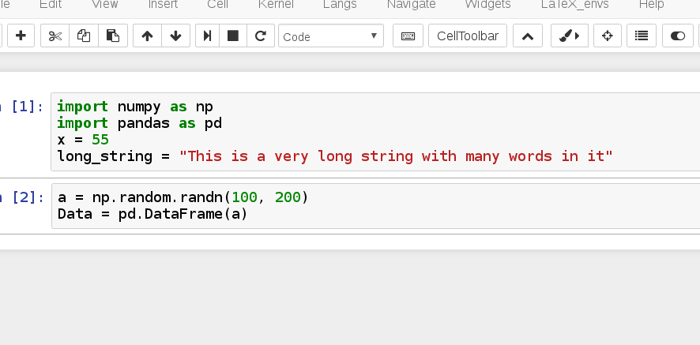

# Python Variable Inspector

## Description and main features

The Python Variable Inspector extension enables to collect all defined variables and display them in a floating window. The window not only display the name of variables but also  their type, size in memory and content. The colums are sortable. The window is draggable, resizable, collapsable. The list of displayed variables is automatically updated at each cell execution. Variables can be deleted from workspace by pushing a link. Position and state (displayed/collapsed) are stored in the notebook's metadata and restored at startup. 

#### Demo:

 
## Configuration
The initial configuration can be given using the IPython-contrib nbextensions facility. It includes:

- Display at startup or not (default: false) 
- Width of columns (actually the max number of charracter to display in each column)
- The state of the toc cell (default: false, ie not present)
- The list of types to exclude from display (default: ['module', 'function', 'builtin_function_or_method', 'instance', '_Feature'])

## Notes
- The displayed size of variables use the `getsizeof()` python method. This method doesn't work for all types, so the reported size is to be considered with some caution. The extension includes some code to correctly return the size of numpy arrays, pandas Series and DataFrame but the size for some other types may be incorrect. 

## History

- @jfbercher march 22, 2017 -- initial release
